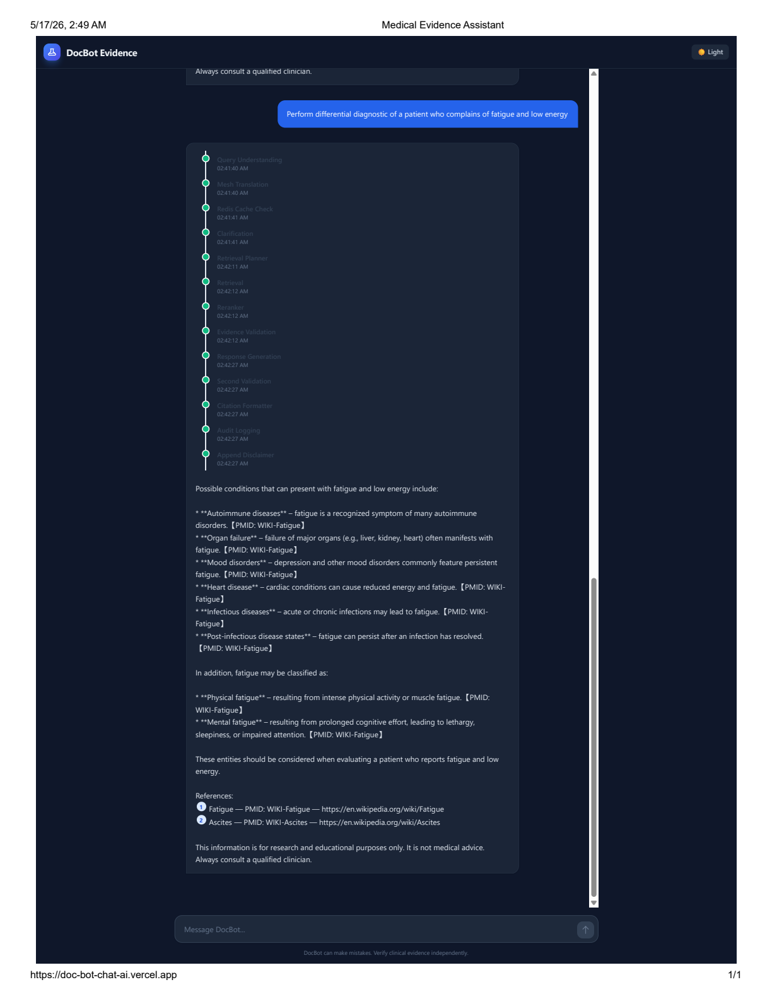
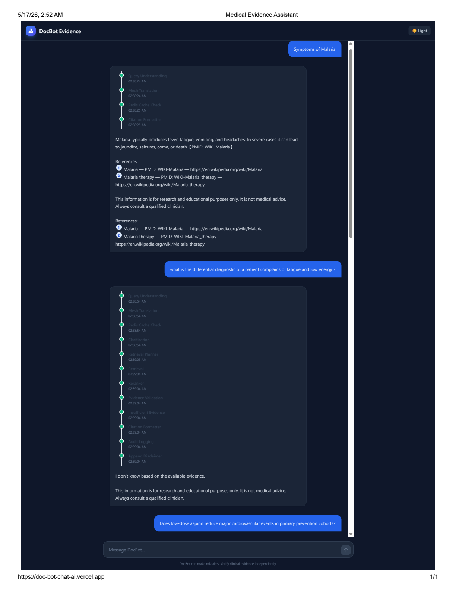
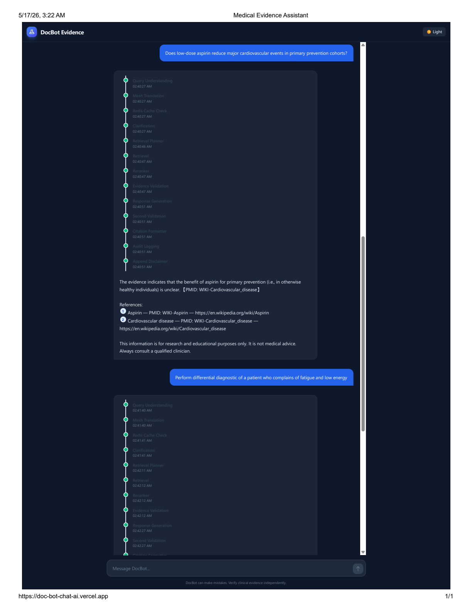
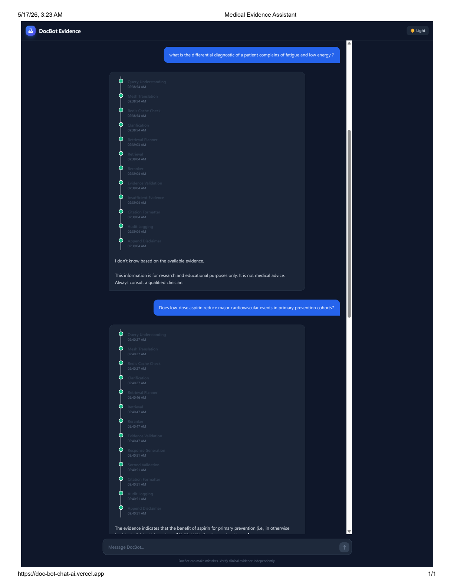
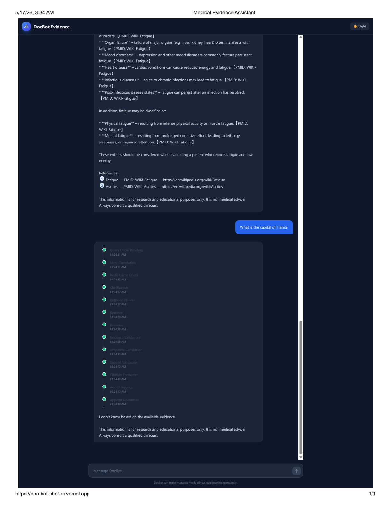
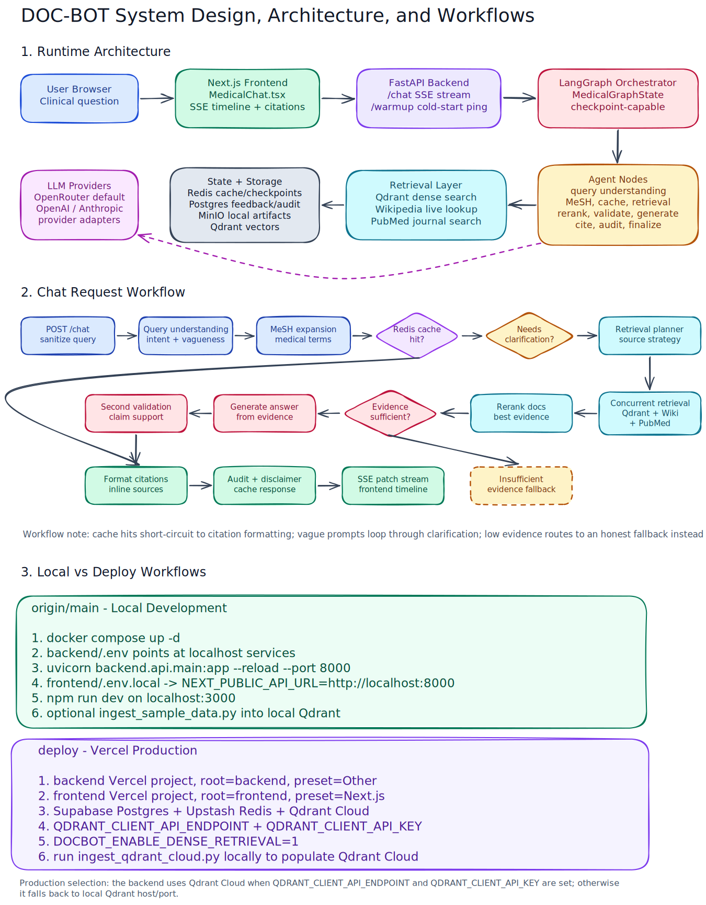

# DOC-BOT: Medical Evidence Retrieval Platform

DOC-BOT is a full-stack medical evidence assistant. The frontend is a Next.js chat UI, the backend is a FastAPI API, and the answer pipeline is a LangGraph workflow that retrieves, validates, cites, audits, and caches evidence-grounded responses.

The project is designed to run in two modes:

- `origin/main`: local development with Docker services for Postgres, Redis, Qdrant, and MinIO.
- `deploy`: serverless/cloud deployment on Vercel with managed services such as Supabase, Upstash Redis, and Qdrant Cloud.

This repository is not a generic chatbot. The graph is built around medical evidence grounding: every normal response should flow through retrieval, reranking, validation, citation formatting, audit logging, and final safety disclaimers.

---

## Deployed Response Previews

GitHub does not render PDF pages inline inside a README, so the deployment captures are stored as PNG previews under `assets/readme/previews/`. These examples show how the deployed assistant responds to different prompts, including normal evidence retrieval, issue cases, and false-information handling.

### Standard Evidence Response



### Prompt Variation 1



### Prompt Variation 2



### Issue Case



### False-Information Handling



---

## Architecture Overview

```text
Browser
  |
  |  Next.js chat UI
  v
frontend/components/MedicalChat.tsx
  |
  |  POST /chat, Server-Sent Events stream
  v
backend/api/chat.py
  |
  |  lazy-builds LangGraph once per process
  v
backend/graph/builder.py
  |
  |  stateful multi-node medical evidence graph
  v
Agents: query understanding -> MeSH -> cache -> clarification -> retrieval
        -> reranking -> evidence validation -> generation/fallback
        -> second validation -> citations -> audit -> disclaimer -> cache store
  |
  |  uses local or cloud infrastructure
  v
Redis / Postgres / Qdrant / MinIO / live Wikipedia / live PubMed / LLM provider
```

### Runtime components

- **Frontend:** Next.js 14, React 18, Tailwind CSS. It renders the chat UI, sends user questions to the backend, reads SSE events, displays graph progress as a timeline, and renders inline citations.
- **API layer:** FastAPI exposes health, chat, feedback, and citation endpoints. The chat endpoint streams graph node updates back to the browser.
- **Graph layer:** LangGraph defines the production medical evidence workflow and its checkpointing behavior.
- **Agent layer:** Individual graph nodes perform query understanding, MeSH expansion, cache checks, retrieval planning, retrieval, reranking, validation, generation, citation formatting, audit logging, final disclaimer attachment, and cache storage.
- **Retrieval layer:** Combines dense vector search from Qdrant with live Wikipedia and PubMed lookup.
- **Storage layer:** Postgres stores feedback/audit-style data, Redis supports caching/checkpoint use cases, Qdrant stores embedded evidence chunks, and MinIO is available for object/artifact storage in local development.
- **LLM layer:** Uses OpenRouter by default, with provider abstractions for OpenAI and Anthropic also present.

---

## End-to-End Request Workflow

1. The user submits a medical question in `frontend/components/MedicalChat.tsx`.
2. The frontend sends `POST /chat` to the backend API base URL.
3. `backend/api/chat.py` sanitizes the query, creates `session_id`, `trace_id`, and `graph_run_id`, then starts the LangGraph stream.
4. `backend/graph/builder.py` builds the production graph with `MedicalGraphState`.
5. Each graph node returns a patch to the shared state. The backend streams those patches as SSE `update` events.
6. The frontend records each node update in a visible timeline and updates the assistant message when `final_response`, `clarification_prompt`, or `citations` arrive.
7. The final tail of the graph formats citations, logs/audits the run, appends a medical disclaimer, and stores cache data when applicable.

The graph is stateful by session. `session_id` maps into LangGraph's configurable `thread_id`, which allows checkpoint-capable execution when a checkpoint backend is configured.

---

## Production LangGraph Workflow

The active graph is built in `backend/graph/builder.py`.

```text
query_understanding
  -> mesh_translation
  -> redis_cache_check
      -> cache hit: citation_formatter -> END
      -> cache miss: clarification
          -> clarification loop: query_understanding
          -> planner: retrieval_planner
              -> retrieval
              -> reranker
              -> evidence_validation
                  -> insufficient: insufficient_evidence -> citation_formatter
                  -> sufficient: response_generation -> second_validation -> citation_formatter
                      -> audit_logging
                      -> append_disclaimer
                      -> cache_store
                      -> END
```

### Important graph behaviors

- **Cache short-circuit:** If Redis has a usable cached result, the graph skips expensive retrieval/generation and goes directly to citation formatting.
- **Clarification loop:** If the query is too vague, the graph can produce a clarification prompt and route back through query understanding after resume.
- **Multi-source retrieval:** `backend/agents/retrieval.py` concurrently queries Qdrant, Wikipedia, and PubMed with timeouts.
- **Graceful degradation:** Retrieval failures are logged and converted into structured graph state instead of crashing the request.
- **Evidence gating:** `evidence_validation` decides whether the system has enough evidence to generate a grounded answer.
- **Second validation:** The generated response is checked again before citations and finalization.
- **Finalization:** Audit logging, disclaimer attachment, and cache storage happen at the end of full non-cache runs.

There is also a smaller legacy workflow in `backend/graph/workflow.py` using `GroundedGraphState`. The main API uses `build_medical_evidence_graph()` from `backend/graph/builder.py`.

---

## Repository Layout

```text
DOC-BOT/
  backend/              FastAPI, LangGraph, retrieval, storage, LLM, validation
  frontend/             Next.js chat application
  scripts/              ingestion, debug, validation, and provider test scripts
  tests/                unit, grounded graph, and retrieval evaluation tests
  docker-compose.yml    local Postgres, Redis, Qdrant, and MinIO
  pytest.ini            test runner configuration
  README.md             project architecture and workflow guide
```

### Root files

- `.gitattributes`: Git text/binary handling.
- `.gitignore`: Excludes local environments, generated caches, build outputs, and secrets.
- `docker-compose.yml`: Local infrastructure stack. Starts Postgres, Redis, Qdrant, and MinIO on a shared Docker network.
- `pytest.ini`: Points pytest at `tests/` and enables async test support.
- `DEPLOY_SYNC_PLAN.md`: Notes on keeping `deploy` aligned with `main` and why deploy has extra hardening.
- `DEPLOYMENT_READY.md`: Deployment readiness notes/checklist.
- `QDRANT_CLOUD_SETUP.md`: Qdrant Cloud setup guidance.
- `STORAGE_STRATEGY.md`: Storage design notes for local/cloud services.
- `README.md`: This guide.

---

## Backend Folder

The backend is a Python package under `backend/`. It is installed locally with `pip install -e ".\backend[dev]"` and served with Uvicorn.

### Backend root files

- `backend/__init__.py`: Marks the backend as a package.
- `backend/main.py`: Compatibility entrypoint for serving the API.
- `backend/api/main.py`: Main FastAPI app. Configures lifespan startup, logging, tracing, CORS, request IDs, root health metadata, and routers.
- `backend/.env.example`: Environment variable template.
- `backend/.env`: Local secrets/config file. Do not commit real secrets.
- `backend/pyproject.toml`: Python package metadata, dependencies, dev dependencies, and pytest settings.
- `backend/requirements.txt`: Requirements file used by deployment platforms such as Vercel.
- `backend/vercel.json`: Vercel Python function configuration. Rewrites all backend requests to `api/main.py` and sets a 60 second function limit.
- `backend/.vercelignore`: Excludes unnecessary files from Vercel backend builds.
- `backend/README.md`: Backend-specific notes if present.

### `backend/api/`

FastAPI routers and API boundaries.

- `main.py`: Creates the FastAPI app and includes all routers.
- `chat.py`: Main streaming chat endpoint. Builds the graph lazily, streams LangGraph updates as Server-Sent Events, supports resume payloads, and sanitizes user queries.
- `health.py`: Health/readiness endpoint.
- `feedback.py`: Feedback endpoint for thumbs up/down style ratings. The frontend does not currently call this endpoint.
- `citations.py`: Citation-related API routes.

### `backend/graph/`

LangGraph wiring and state definitions.

- `builder.py`: Production graph definition. This is the primary workflow used by `/chat`.
- `state.py`: Typed graph state. `MedicalGraphState` is the production state; `GroundedGraphState` supports the older minimal graph.
- `checkpoints.py`: Selects the LangGraph checkpoint backend.
- `nodes.py`: Node wrappers for the older grounded workflow.
- `workflow.py`: Legacy linear graph: retrieve -> validate -> generate/fallback -> cite.

### `backend/agents/`

Graph node implementations. Each file owns one major step in the medical answer pipeline.

- `query_understanding.py`: Classifies intent and determines whether the user query is specific enough.
- `mesh_translation.py`: Expands clinical terms using MeSH-style medical vocabulary.
- `cache_check.py`: Checks Redis/cache state before expensive work.
- `clarification.py`: Generates or handles clarification loops for vague questions.
- `retrieval_planner.py`: Builds the retrieval plan, including query variants and source requirements.
- `retrieval.py`: Concurrently retrieves evidence from Qdrant, Wikipedia, and PubMed with safe timeouts.
- `reranker.py`: Reorders retrieved documents by relevance.
- `validation.py`: Checks whether the retrieved evidence is sufficient.
- `insufficient_evidence.py`: Produces a grounded fallback when evidence is not strong enough.
- `generation_node.py`: Generates the answer from retrieved evidence.
- `response_generation.py`: Response-generation support/compatibility logic.
- `post_validation.py`: Runs a second validation pass after answer generation.
- `citation_formatter.py`: Converts evidence metadata into user-visible citation structures.
- `audit_logger.py`: Records trace/audit details.
- `finalization.py`: Appends disclaimers and stores cache entries.
- `response.py`: Response helper logic.

### `backend/retrieval/`

Evidence retrieval primitives.

- `embeddings.py`: Embedding model setup and batch embedding helpers.
- `chunking.py`: Splits medical text into retrievable chunks.
- `qdrant_store.py`: Qdrant vector store operations.
- `hybrid_search.py`: Dense/hybrid retrieval orchestration.
- `live_search.py`: Live Wikipedia and PubMed search helpers.
- `reranking.py`: Reranking helpers used by retrieval/agent code.

### `backend/db/`

Database and service clients.

- `postgres.py`: Postgres connection logic for local or cloud databases.
- `redis.py`: Redis connection logic.
- `qdrant.py`: Qdrant client creation, including cloud-compatible behavior.
- `minio.py`: MinIO object storage client for local artifact storage.

### `backend/cache/`

- `redis_cache.py`: Redis-backed cache utilities.

### `backend/core/`

Shared application configuration and safety utilities.

- `config.py`: Pydantic settings. Reads `backend/.env`, defines defaults for Postgres, Redis, Qdrant, MinIO, LLMs, thresholds, checkpointing, and telemetry.
- `constants.py`: Shared constants.
- `logging.py`: Logging configuration.
- `security.py`: Query sanitization and request safety helpers.

### `backend/llm/`

LLM provider abstraction.

- `provider.py`: Common provider interface/factory logic.
- `openrouter_provider.py`: OpenRouter implementation and default path.
- `openai_provider.py`: OpenAI-compatible provider.
- `anthropic_provider.py`: Anthropic-compatible provider.

### `backend/services/`

Service-level wrappers used by agents and APIs.

- `citation_service.py`: Citation formatting/service helpers.
- `embedding_service.py`: Embedding service abstraction.
- `mesh_service.py`: MeSH/medical term expansion service.
- `retrieval_service.py`: Retrieval orchestration service helpers.
- `validation_service.py`: Evidence validation service helpers.

### `backend/models/`

Pydantic/data models.

- `schemas.py`: API and internal schema models.
- `audit.py`: Audit/trace model structures.

### `backend/ingestion/`

Background ingestion support.

- `pubmed.py`: PubMed ingestion utilities.
- `scheduler.py`: Scheduling hooks for ingestion jobs.
- `worker.py`: Worker logic for ingestion/background processing.

### `backend/validation/`

Evidence and hallucination validation logic.

- `evidence_validator.py`: Evidence sufficiency and quality checks.
- `hallucination_checks.py`: Checks intended to prevent unsupported claims.

### `backend/telemetry/`

- `tracing.py`: OpenTelemetry tracing setup.

---

## Frontend Folder

The frontend is a Next.js app in `frontend/`.

### Frontend root files

- `package.json`: Next.js scripts and dependencies.
- `package-lock.json`: Locked npm dependency versions.
- `.env.example`: Frontend environment template. The important value is `NEXT_PUBLIC_API_URL`.
- `next.config.js`: Next.js config.
- `tailwind.config.ts`: Tailwind theme/content config.
- `postcss.config.js`: PostCSS/Tailwind pipeline config.
- `tsconfig.json`: TypeScript config.
- `next-env.d.ts`: Next.js TypeScript declarations.

### `frontend/app/`

- `layout.tsx`: Root layout for the app.
- `page.tsx`: Main page that mounts the medical chat experience.
- `globals.css`: Global Tailwind and application styles.

### `frontend/components/`

- `MedicalChat.tsx`: Main chat client component. It sends `POST /chat`, reads streamed SSE updates, shows the active graph timeline, supports dark/light UI state, renders assistant responses, and converts inline citation markers like `[1]` into citation links.

---

## Scripts Folder

The `scripts/` directory contains local utilities for ingestion, debugging, and deployment validation.

- `ingest_qdrant_cloud.py`: Main Qdrant Cloud ingestion script. Use this to populate the cloud vector database from local execution.
- `ingest_sample_data.py`: Ingests local/sample evidence data for development.
- `ingest data to cloud.py`: Older or alternate cloud ingestion script; prefer `ingest_qdrant_cloud.py` unless you specifically need this variant.
- `clear_qdrant.py`: Clears Qdrant data.
- `check_fastembed.py`: Verifies FastEmbed setup.
- `debug_graph.py`: Runs/debugs the LangGraph pipeline from the command line.
- `debug_retrieval.py`: Debugs retrieval behavior.
- `validate_deploy.py`: Deployment validation helper.
- `test_llm.py`, `test_llama.py`, `test_deepseek.py`, `test_live.py`: Provider/live integration smoke tests.
- `test_pg.py`: Postgres connectivity test.

---

## Tests Folder

- `tests/test_grounded_graph.py`: Tests grounded graph behavior.
- `tests/unit/test_medical_graph_compile.py`: Verifies that the production medical graph compiles.
- `tests/retrieval_eval/metrics.py`: Retrieval evaluation metrics.
- `tests/retrieval_eval/test_retrieval.py`: Retrieval evaluation tests.
- `tests/retrieval_eval/debug.py`: Retrieval evaluation debugging helper.

Run tests from the repository root:

```powershell
$env:PYTHONPATH="."
pytest
```

---

## Local Workflow: `origin/main`

Use `origin/main` for local development. In this workflow, Docker provides the backing services and the backend/frontend are run directly on your machine.

### 1. Check out main

```powershell
git checkout main
git pull origin main
```

### 2. Start local infrastructure

```powershell
docker compose up -d
```

This starts:

- Postgres at `localhost:5432`
- Redis at `localhost:6379`
- Qdrant REST at `localhost:6333`
- Qdrant gRPC at `localhost:6334`
- MinIO API at `localhost:9000`
- MinIO console at `localhost:9001`

### 3. Configure backend environment

Copy `backend/.env.example` to `backend/.env`, then set at least:

```env
OPENROUTER_API_KEY=your-key
POSTGRES_HOST=localhost
POSTGRES_PORT=5432
POSTGRES_DB=medical_db
POSTGRES_USER=medical_user
POSTGRES_PASSWORD=medical_password
REDIS_URL=redis://localhost:6379/0
QDRANT_HOST=localhost
QDRANT_PORT=6333
QDRANT_COLLECTION=medical_evidence
CHECKPOINT_BACKEND=memory
```

For local dense retrieval, either leave `DOCBOT_ENABLE_DENSE_RETRIEVAL` unset or set:

```env
DOCBOT_ENABLE_DENSE_RETRIEVAL=1
```

### 4. Install and run the backend

From the repository root:

```powershell
pip install -e ".\backend[dev]"
$env:PYTHONPATH="."
python -m uvicorn backend.api.main:app --reload --host 0.0.0.0 --port 8000
```

Useful backend URLs:

- `http://localhost:8000/`
- `http://localhost:8000/health`
- `http://localhost:8000/docs`
- `http://localhost:8000/chat`

### 5. Configure and run the frontend

Create `frontend/.env.local`:

```env
NEXT_PUBLIC_API_URL=http://localhost:8000
```

Run the frontend:

```powershell
cd frontend
npm install
npm run dev
```

Open `http://localhost:3000`.

### 6. Optional local ingestion

If Qdrant is empty, run sample ingestion or a targeted ingestion script before expecting strong dense retrieval results:

```powershell
$env:PYTHONPATH="."
python scripts/ingest_sample_data.py
```

For debugging:

```powershell
$env:PYTHONPATH="."
python scripts/debug_retrieval.py
python scripts/debug_graph.py
```

---

## Deploy Workflow: `deploy`

Use the `deploy` branch for Vercel/cloud deployment. This branch keeps the same core AI graph but is configured for serverless limits and managed services.

### Deployment architecture

```text
Vercel frontend project
  Root Directory: frontend
  NEXT_PUBLIC_API_URL -> deployed backend URL

Vercel backend project
  Root Directory: backend
  Framework Preset: Other
  backend/vercel.json rewrites all routes to api/main.py

Managed services
  Supabase Postgres
  Upstash Redis
  Qdrant Cloud
  Optional object storage if needed
```

### 1. Check out deploy

```powershell
git checkout deploy
git pull origin deploy
```

### 2. Configure managed services

Create or collect credentials for:

- **Supabase Postgres:** feedback, audit, and checkpoint-compatible relational storage.
- **Upstash Redis:** cache/checkpoint-compatible Redis.
- **Qdrant Cloud:** vector evidence database.
- **OpenRouter:** default LLM provider.

Backend cloud environment variables should include:

```env
OPENROUTER_API_KEY=your-key
llm_model_generation=openai/gpt-oss-120b:free
llm_model_validation=openai/gpt-oss-120b:free
llm_model_query=openai/gpt-oss-120b:free

POSTGRES_DSN=postgresql://...
REDIS_URL=redis://...

QDRANT_CLIENT_API_ENDPOINT=https://your-cluster.qdrant.io
QDRANT_CLIENT_API_KEY=your-key
QDRANT_COLLECTION=medical_evidence

DOCBOT_ENABLE_DENSE_RETRIEVAL=1
LOG_LEVEL=INFO
```

### 3. Deploy the backend to Vercel

1. Import the repository into Vercel.
2. Name the project something like `doc-bot-backend`.
3. Set **Root Directory** to `backend`.
4. Set **Framework Preset** to `Other`.
5. Add the backend environment variables.
6. Deploy.

`backend/vercel.json` sets the backend function maximum duration to 60 seconds and rewrites incoming paths to the FastAPI entrypoint.

### 4. Deploy the frontend to Vercel

1. Import the repository into Vercel again as a second project.
2. Name it something like `doc-bot-frontend`.
3. Set **Root Directory** to `frontend`.
4. Set **Framework Preset** to `Next.js`.
5. Add:

```env
NEXT_PUBLIC_API_URL=https://your-backend-vercel-url
```

6. Deploy.

### 5. Populate Qdrant Cloud

Run cloud ingestion locally from the repo root after configuring Qdrant Cloud credentials in `backend/.env`:

```powershell
$env:PYTHONPATH="."
python scripts/ingest_qdrant_cloud.py core
```

The script batches embeddings and writes to the cloud collection. This keeps Vercel functions focused on inference instead of expensive ingestion.

### 6. Validate deploy behavior

Run local smoke checks before pushing deployment changes:

```powershell
$env:PYTHONPATH="."
python scripts/validate_deploy.py
python scripts/debug_graph.py
pytest
```

Then push:

```powershell
git push origin deploy
```

Vercel should build and deploy from the pushed branch depending on your Vercel project settings.

---

## Main vs Deploy: What Changes

| Area | `origin/main` local workflow | `deploy` cloud workflow |
| --- | --- | --- |
| Infrastructure | Docker Compose services | Managed cloud services |
| Postgres | Local container | Supabase or another cloud Postgres |
| Redis | Local container | Upstash or another cloud Redis |
| Qdrant | Local container | Qdrant Cloud |
| MinIO | Local container | Usually omitted or replaced by cloud object storage |
| Backend hosting | Uvicorn on `localhost:8000` | Vercel Python serverless functions |
| Frontend hosting | Next dev server on `localhost:3000` | Vercel Next.js deployment |
| Timeouts | Development-friendly | Tuned for Vercel's 60 second function limit |
| Ingestion | Can target local Qdrant | Run locally, write to Qdrant Cloud |

The intent is that `main` remains comfortable for development while `deploy` carries cloud-specific hardening. Keep behavior changes in sync carefully: feature logic should stay equivalent, but deployment settings, timeout values, and service credentials differ.

---

## Feedback Mechanism

The backend includes a `/feedback` API for thumbs up/down style ratings. It is intended for production monitoring and RLHF-style review loops:

- Stores rating data.
- Associates feedback with `session_id` and `trace_id`.
- Helps developers inspect bad responses and diagnose graph failures.

The current frontend does not render thumbs up/down controls, so the endpoint is not called by the UI yet. If no feedback has been submitted, related database tables may not exist or may remain empty depending on the database initialization path.

---

## Common Commands

```powershell
# Start local dependencies
docker compose up -d

# Stop local dependencies
docker compose down

# Run backend
$env:PYTHONPATH="."
python -m uvicorn backend.api.main:app --reload --host 0.0.0.0 --port 8000

# Run frontend
cd frontend
npm run dev

# Run tests
$env:PYTHONPATH="."
pytest

# Debug graph
$env:PYTHONPATH="."
python scripts/debug_graph.py

# Ingest Qdrant Cloud
$env:PYTHONPATH="."
python scripts/ingest_qdrant_cloud.py core
```

---

## Operational Notes

- The backend reads settings from `backend/.env` through `backend/core/config.py`.
- `OPENROUTER_API_KEY` is required for the default LLM path.
- Qdrant dense retrieval is enabled by default outside Vercel unless `DOCBOT_ENABLE_DENSE_RETRIEVAL=0`.
- In Vercel, set `DOCBOT_ENABLE_DENSE_RETRIEVAL=1` only when Qdrant Cloud credentials are configured and ingestion has populated the collection.
- The chat API streams progress, so frontend behavior depends on the SSE event format in `backend/api/chat.py`.
- Medical responses should be independently verified. The assistant is evidence-oriented, not a clinical authority.


---


## System Design, Architecture and Workflows Diagrams


